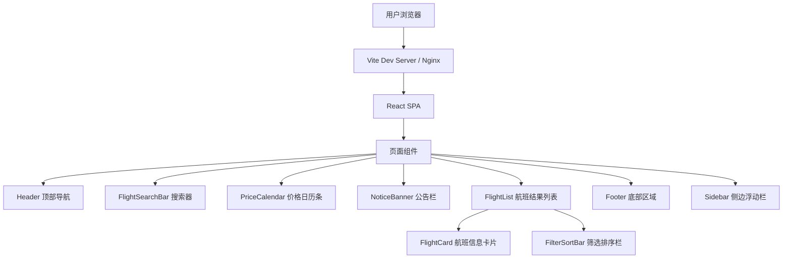
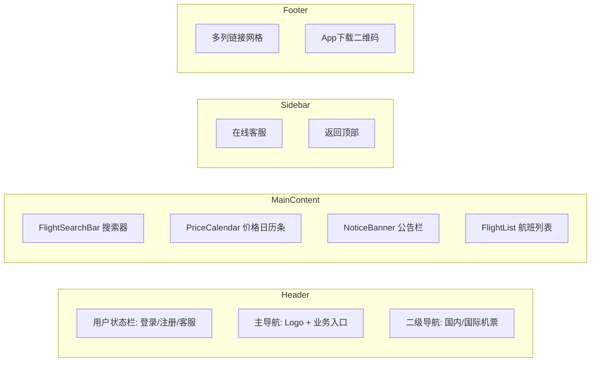

# 国际机票搜索结果页 - 项目设计文档

## 一、系统架构

## 二、页面模块结构

## 三、核心组件清单

| 组件名 | 功能 | 位置 |
|--------|------|------|
| Header | 顶部导航，含用户状态栏和主导航 | 页面顶部 |
| FlightSearchBar | 搜索条件输入（城市/日期/人数/舱位） | 主内容区顶部 |
| PriceCalendar | 横向日期价格滚动条 | 搜索器下方 |
| NoticeBanner | 系统公告/出行提示 | 价格日历下方 |
| FilterSortBar | 筛选与排序工具栏 | 航班列表上方 |
| FlightCard | 单个航班信息卡片 | 航班列表内 |
| FlightDetailPanel | 航班详情展开面板 | 卡片内展开 |
| Sidebar | 浮动工具栏（客服/回顶部） | 页面右侧 |
| Footer | 底部链接区域 | 页面底部 |

## 四、UI/UX 规范

### 色彩体系
- 主色调（活力绿）：`#00b894` / `#00a884`
- 辅助色-橙（价格）：`#ff6b35`
- 辅助色-蓝（链接）：`#2d7dd2`
- 背景色-主：`#ffffff`
- 背景色-辅：`#f5f6fa`
- 文字色-主：`#2d3436`
- 文字色-辅：`#999999`
- 分割线：`#e8e8e8`

### 字体规范
- 标题：16px / 18px，font-weight: 600
- 正文：14px，font-weight: 400
- 辅助文字：12px，color: #999
- 价格：20px-24px，font-weight: 700，color: #ff6b35

### 间距规范
- 基础单位：8px
- 模块间距：24px
- 卡片内间距：16px-20px
- 元素间距：8px / 12px

### 圆角规范
- 卡片：8px
- 按钮：4px
- 输入框：4px
- 标签：12px（全圆角）

### 阴影规范
- 卡片：`0 2px 12px rgba(0,0,0,0.08)`
- 悬浮：`0 4px 20px rgba(0,0,0,0.12)`
- 侧边栏：`0 2px 8px rgba(0,0,0,0.1)`
